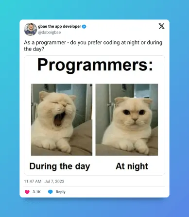

Image source:  https://medium.com/@daboigbae/five-programming-memes-that-will-make-you-cry-with-laughter-49431c8e1e14

## Note:

This project includes two datasets.  The default database is used when the project is run.

The second dataset has deliberate type errors to show how error handling and validation are implemented.  The project will crash if the second dataset is loaded into state; control flow is written to prevent that from happening when attempted.

## Reflection:

1.  How you implemented React and TypeScript features

Used Typescript to define interfaces for React components.  Used React to pass state down the component hierarchy, callback functions to effectively pass state up.

2.  The challenges you encountered and how you overcame them

Instructions state to implement a jolly lot of features, but many (even most) of those features are not included in grading criteria.  Stuff like 'Add date formatting utilities' and 'Add task statstics' aren't a big deal to implement individually, but everything takes time.

As it is, I maanaged time so I'll complete everything on the grading criteria.  I think between this and lab 3, I've demonstrated I'm able to handle stuff like date formatting and task statistics.  (Pass yyyy-mm-dd into Date object then slice / reformat as desired to format date; add things like tasklist.length and .length or equivalent of different keys.)

The only tricky part is deciding how to handle filters.  For example, if a user wants to put in a filter that will return all tasks with 'cat' *or* 'dog' in the title where such tasks are also after a certain date, there needs to be some sort of 'or' handler added to the filter, which complicates how the user interface is designed.  But all of that is really a design issue, not a programming or logic issue.

3.  Your approach to component composition and state management

State gets declared at the lowest level where that state is handled within the component itself and/or descendants.  For example, tasklist was pretty top-level so was put in state in App (near the top).  But showing/hiding a form didn't need to be stored in state at that high of a level; rather showing/hiding form state was done in TaskFormContainer.

## Documentation

Used some utility functions and components I wrote from Lab 3.
Based form on course material.
https://developer.mozilla.org/en-US/docs/Web/JavaScript/Reference/Global_Objects/Set
https://developer.mozilla.org/en-US/docs/Web/JavaScript/Reference/Global_Objects/Array/reduce
https://legacy.reactjs.org/docs/forms.html
https://www.w3schools.com/html/html_form_input_types.asp
https://developer.mozilla.org/en-US/docs/Web/JavaScript/Reference/Global_Objects/Date
https://react.dev/reference/react-dom/components/input
https://developer.mozilla.org/en-US/docs/Web/HTML/How_to/Use_data_attributes